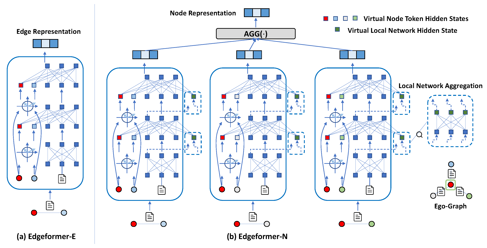

# Edgeformers

This repository contains the source code and datasets for [Edgeformers: Graph-Empowered Transformers for Representation Learning on Textual-Edge Networks](https://openreview.net/pdf?id=2YQrqe4RNv), published in ICLR 2023.

## Links

- [Requirements](#Requirements)
- [Overview](#Overview)
- [Edge Representation Learning](#Edge-Representation-Learning)
- [Node Representation Learning](#Node-Representation-Learning)
- [Citations](#Citations)

## Requirements

The code is written in Python 3.6. Before running, you need to first install the required packages by typing following commands (Using a virtual environment is recommended):

```
pip3 install -r requirements.txt
```

## Overview
**Edgeformers** contain two transformer-based architecture, namely **Edgeformer-E** and **Edgeformer-N**, for edge representation learning and node representation learning respectively.

<!-- </img> -->
<p align="center">
  
</p>

## Edge Representation Learning (Edgeformer-E)
### Data Preparation
**Download processed data.** To reproduce the results in our paper, you need to first download the processed [datasets](https://drive.google.com/drive/folders/1DP88baeCsJzueSWy4S4VXtdjg1W79Rlt?usp=sharing). Then put the dataset folders under ```Edgeformer-E/``` and create a new ```ckpt/``` folder inside each dataset folder for checkpoint saving (e.g., ```cd Edgeformer-E/Apps```, ```mkdir ckpt```).

The format of each processed data sample is as follows:
```
edge_text\$\$node1_id\$\$node2_id\$\$edge_label\n
```

For example, a sample in Apps dataset is like this:
```
Get this game!  Beautiful graphics, entertaining story.  Challenging yet not unsolvable.  One of the best hidden object games out there!\$\$49138\$\$909\$\$4
```

**Raw data & data processing.** Raw data can be downloaded from [Amazon](https://nijianmo.github.io/amazon/index.html#code) and [Goodreads](https://sites.google.com/eng.ucsd.edu/ucsdbookgraph/reviews?authuser=0) directly. You can also find our data processing codes [here](https://drive.google.com/drive/folders/1vTNiOCGwd7Mik-ntl6hsRHaNo80GXWuN?usp=sharing). They might be useful if you want to obtain processed dataset for other networks in [Amazon](https://nijianmo.github.io/amazon/index.html#code) and [Goodreads](https://sites.google.com/eng.ucsd.edu/ucsdbookgraph/reviews?authuser=0).

**Use your own dataset.** To run our model on your own data, you need to prepare the following things:
(1) The network config file ```node_num.pkl```. (2) Model training and testing files ```train.tsv, val.tsv, test.tsv```. Please refer to the file in our processed dataset for their format information.

### Running
**Train**
```
CUDA_VISIBLE_DEVICES=0 python Edgeformer-E/main.py --data_path $data_path
```
The dataset path is $data_path and the model checkpoints will be saved in $data_path/ckpt. Since tokenizing will take a great amount of time, for the first run on a new dataset, the tokenized data files will be saved in $data_path as cache files for future use. You may change the hyperparameters for your own preference.


**Test**
```
CUDA_VISIBLE_DEVICES=0 python Edgeformer-E/main.py --mode test --data_path $data_path --load_ckpt_name $load_ckpt
```
The dataset path is $data_path. $load_ckpt refers to the checkpoint file you want to test. Macro-f1 and Micro-f1 scores will be shown in the last several lines of the output.


## Node Representation Learning (Edgeformer-N)
### Data Preparation
**Download processed data.** To reproduce the results in our paper, you need to first download the processed [datasets](https://drive.google.com/drive/folders/1TMUvw_KYtMMhG2lyHVYVOUV6CqSxEPUr?usp=sharing). Then put the dataset folders under ```Edgeformer-N/``` and create a new ```ckpt/``` folder inside each dataset folder for checkpoint saving (e.g., ```cd Edgeformer-N/Apps```, ```mkdir ckpt```).

The format of each processed data sample (a node pair) is as follows:
```
node1_id\*\*node1_edge_text_group1\*\*node1_edge_text_group2\*\*node1_neighbor_node_group1\*\*node1_neighbor_node_group2\$\$node1_id\*\*node1_edge_text_group1\*\*node1_edge_text_group2\*\*node1_neighbor_node_group1\*\*node1_neighbor_node_group2\$\$label\n
```
It can be simplified to ```node1_info\$\$node2_info\$\$label\n```. Each text (seperated by ```\t```) in ```{x}_edge_text_group{x}``` corresponds to a neighbor node (seperated by ```\t```) in ```node{x}_neighbor_node_group{x}``` (```node{x}``` is linked to this neighbor node with the text on the edge). The number of text in ```node{x}_edge_text_group{x}``` will be same to the number of nodes in ```node{x}_neighbor_node_group{x}```. We have two groups of edge_texts/neighbor_nodes to take both positive reviewed neighbors and negative reviewed neighbors into consideration in ego-graph sampling for Amazon and Goodreads dataset. While for stackoverflow, each query node only have one group of edge_texts/neighbor_nodes (```node{x}_edge_text_group2```=NULL, ```node{x}_neighbor_node_group2```=NULL).

We will utilize node pairs with label 1 to train the model.

**Raw data & data processing.** Raw data can be downloaded from [Amazon](https://nijianmo.github.io/amazon/index.html#code) and [Goodreads](https://sites.google.com/eng.ucsd.edu/ucsdbookgraph/reviews?authuser=0) directly. You can also find our data processing codes [here](https://drive.google.com/drive/folders/1Ge2gSdWOmXbwAm5tZy4uu0apaBx6jtm6?usp=sharing). They might be useful if you want to obtain processed dataset for other networks in [Amazon](https://nijianmo.github.io/amazon/index.html#code), [Goodreads](https://sites.google.com/eng.ucsd.edu/ucsdbookgraph/reviews?authuser=0) and [Stackoverflow](https://www.kaggle.com/datasets/stackoverflow/stackoverflow?select=posts_moderator_nomination).

**Use your own dataset.** To run our model on your own data, you need to prepare the following things:
(1) The network config file ```node_num.pkl```. (2) Model training and testing files ```train.tsv, val.tsv, test.tsv```. (3) The neighbor sampling information file ```neighbor_sampling.pkl```. Please refer to the file in our processed dataset for their format information.


### Running
**Train**
```
CUDA_VISIBLE_DEVICES=0 python Edgeformer-N/main.py --data_path $data_path
```
The dataset path is $data_path and the model checkpoints will be saved in $data_path/ckpt. Since tokenizing will take a great amount of time, for the first run on a new dataset, the tokenized data files will be saved in $data_path as cache files for future use. You may change the hyperparameters for your own preference.

**Test**
```
CUDA_VISIBLE_DEVICES=0 python Edgeformer-N/main.py --mode test --data_path $data_path --load_ckpt_name $load_ckpt
```
The dataset path is $data_path. $load_ckpt refers to the checkpoint file you want to test. MRR and NDCG scores will be shown in the last several lines of the output.

**Infer**
```
CUDA_VISIBLE_DEVICES=0 python Edgeformer-N/main.py --mode infer --data_path $data_path --load True --load_ckpt_name $load_ckpt
```
By running this, embeddings will be generated for nodes in $data_path/train.tsv and are saved to $data_path/EdgeformerN.npy.

## Citations

Please cite the following paper if you find the code helpful for your research.
```
@inproceedings{jin2023edgeformers,
  title={Edgeformers: Graph-Empowered Transformers for Representation Learning on Textual-Edge Networks},
  author={Jin, Bowen and Zhang, Yu and Meng, Yu and Han, Jiawei},
  booktitle={International Conference on Learning Representations},
  year={2023}
}
```
